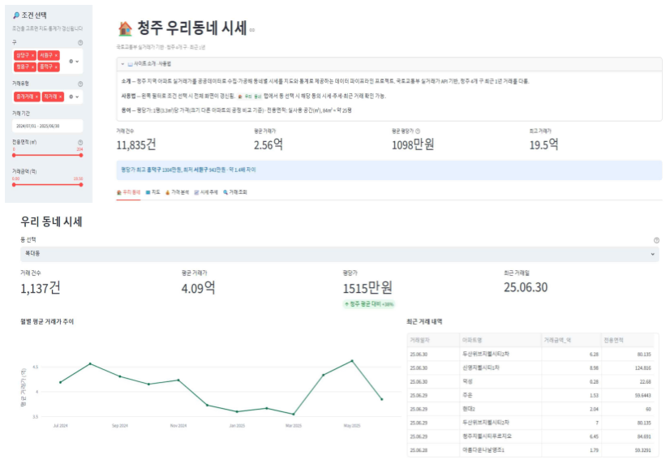
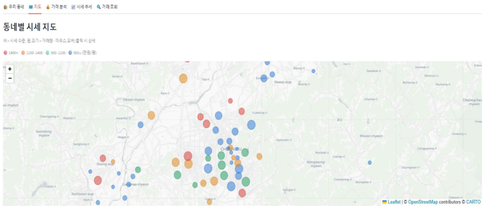
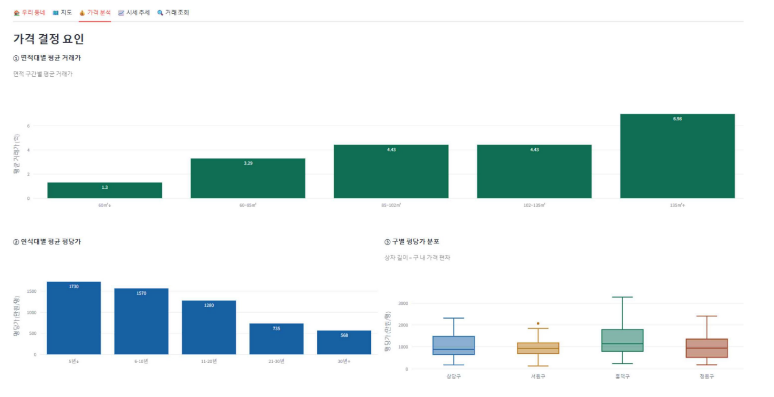
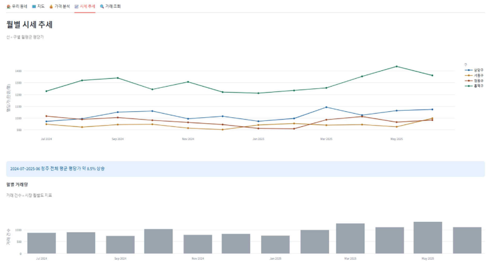
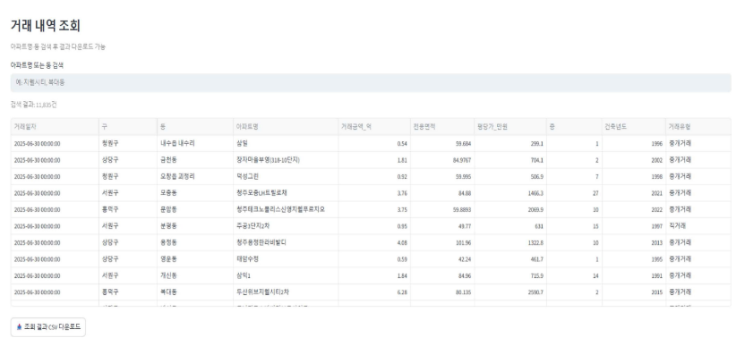
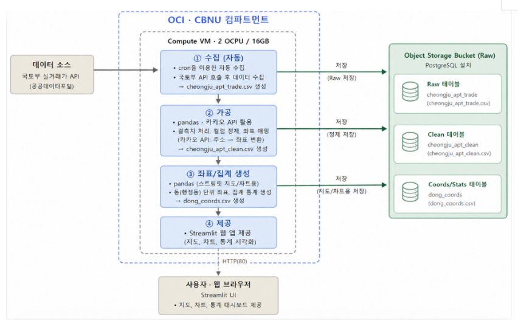

# 청주 우리동네 시세 🏠

**국토교통부 실거래가 API 기반 청주 아파트 시세 데이터 파이프라인 및 시각화 웹 서비스**

Oracle Cloud Infrastructure(OCI) 위에서 **수집 → 저장 → 가공 → 제공** 4단계 데이터 파이프라인을 구축하고, 청주 4개 구의 아파트 실거래가를 지도·통계로 시각화하는 웹 대시보드를 제공합니다.

---

## 목차

1. [서비스 소개 및 사용 시나리오](#1-서비스-소개-및-사용-시나리오)
2. [아키텍처](#2-아키텍처)
3. [기술 스택](#3-기술-스택)
4. [프로젝트 구조](#4-프로젝트-구조)
5. [설치 및 실행 방법](#5-설치-및-실행-방법)
6. [데이터 흐름 상세 설명](#6-데이터-흐름-상세-설명)
7. [한계점 및 향후 개선 방향](#7-한계점-및-향후-개선-방향)
8. [출처 및 라이선스](#8-출처-및-라이선스)

---

## 1. 서비스 소개 및 사용 시나리오

### 서비스 개요

국토교통부가 매일 갱신하는 아파트 매매 실거래가 데이터를 자동으로 수집·정제하여 **청주 시민이 우리 동네 시세를 한눈에 확인**할 수 있는 웹 서비스입니다.

### 사용 시나리오

- **집을 알아보는 실수요자** — 관심 있는 동을 선택해 해당 동의 평균 시세·월별 추세·최근 거래 내역을 확인하고, 지도에서 주변 동네와 시세를 비교한다.
- **부동산에 관심 있는 시민** — 시세 추세 탭에서 구별 월평균 평당가와 거래량 추이를 보고 시장 흐름을 파악한다.
- **조건 검색이 필요한 사용자** — 거래 조회 탭에서 아파트명·동으로 검색하고, 사이드바 필터(구·기간·면적·금액·거래유형)로 조건을 좁힌 뒤 결과를 CSV로 내려받는다.

### 주요 기능

| 탭 | 기능 |
|---|---|
| 🏠 우리 동네 | 동 선택 시 해당 동의 시세·추세·최근 거래 내역 |
| 🗺️ 지도 | 동별 평균 시세를 색상·크기로 표현한 인터랙티브 지도 |
| 💰 가격 분석 | 면적대·연식대·구별 가격 결정 요인 시각화 |
| 📈 시세 추세 | 구별 월평균 평당가 및 거래량 추이 |
| 🔍 거래 조회 | 아파트명·동 검색, 필터 조건 적용 및 CSV 다운로드 |

### 실행 화면







---

## 2. 아키텍처

### OCI 리소스 구성

| 리소스 | 용도 |
|---|---|
| **Compute VM** (2 OCPU / 16GB) | 수집·가공·제공 계층 실행 |
| **Block Volume** | VM 부트 볼륨 (OS·코드·로그) |
| **Object Storage** (bucket-13-cbnu-lv2) | 원본(raw/) 및 정제(processed/) 데이터 백업 |
| **VCN** + Security List | 8501 포트 개방 (Streamlit 공개용) |

### 아키텍처 다이어그램



전체 워크플로우는 다음과 같습니다.

```
국토부 실거래가 API (XML)
        │
        ▼
① 수집 (collect.py · requests + 재시도 로직)
        │
        ├──▶ Object Storage: raw/cheongju_apt_trade_YYYYMMDD.csv (원본 백업)
        │
        ▼
② 저장 Raw (PostgreSQL · apt_trade)
        │
        ▼
③ 가공 (preprocess.py · pandas + 지오코딩)
        │  · 거래금액 정제 · 평당가·연식 파생
        │  · 취소거래·이상치 제거
        │
        ▼
④ 저장 정제 (PostgreSQL · apt_clean · dong_coords)
        │
        ▼
⑤ 제공 (Streamlit · :8501)
        │
        ▼
사용자 · 웹 브라우저
```

### 자동화

- **cron** — 매일 새벽 3시 `run_pipeline.sh` 자동 실행 (수집 → Object Storage 백업 → 전처리 → DB 적재)
- **@reboot** — VM 부팅 시 Streamlit 자동 실행 (nohup 백그라운드)

---

## 3. 기술 스택

| 계층 | 기술 |
|---|---|
| 인프라 | Oracle Cloud Infrastructure (VM · Block Volume · Object Storage · VCN) |
| 수집 | Python 3.11, `requests`, `python-dotenv` |
| 저장 | PostgreSQL 16, OCI Object Storage |
| 가공 | `pandas`, `numpy`, 카카오 로컬 API (지오코딩) |
| 제공 | Streamlit, Plotly, Folium, streamlit-folium |
| DB 접속 | SQLAlchemy, psycopg2-binary |
| 자동화 | cron, OCI CLI |
| 개발·운영 | VS Code, GitHub, MobaXterm (SSH) |

---

## 4. 프로젝트 구조

```
CLOUD_LV2_PROJECT/
├── src/
│   ├── app.py              # Streamlit 웹 앱
│   ├── collect.py          # 국토부 API 수집 (재시도 로직 포함)
│   ├── preprocess.py       # 정제 + PostgreSQL 적재
│   ├── geocode.py          # 카카오 API 지오코딩
│   └── map_view.py         # 지도 유틸
├── data/                    # 로컬 CSV 산출물
├── output/                  # EDA 시각화 결과
├── docs/
│   ├── architecture.png     # 아키텍처 다이어그램
│   └── screenshots/         # 웹 사이트 실행 화면
│       ├── 01_home.png
│       ├── 02_map.png
│       ├── 03_price_analysis.png
│       ├── 04_trend.png
│       └── 05_search.png
├── requirements.txt
├── README.md
└── .env                     # DB·API 접속정보 (git 제외)
```

---

## 5. 설치 및 실행 방법

### 5-1. 사전 준비

- **OCI 계정** — Compute VM(Oracle Linux 8), Object Storage 버킷 생성
- **PostgreSQL 16** — VM 내 설치, `cj_apt_db` 데이터베이스 생성
- **API 키** — 공공데이터포털 국토부 실거래가 API, 카카오 개발자 REST API

### 5-2. 로컬 개발 환경 실행

```bash
# 1. 저장소 클론
git clone https://github.com/limlimsu/CLOUD_LV2_PROJECT.git
cd CLOUD_LV2_PROJECT

# 2. 가상환경 생성
python3.11 -m venv venv
source venv/bin/activate   # Windows: venv\Scripts\activate

# 3. 의존성 설치
pip install -r requirements.txt

# 4. .env 파일 생성 (프로젝트 루트)
cat > .env << 'EOF'
DB_HOST=localhost
DB_PORT=5432
DB_NAME=cj_apt_db
DB_USER=postgres
DB_PASSWORD=<본인 비밀번호>
SERVICE_KEY=<공공데이터포털 인증키>
EOF

# 5. Streamlit 실행
streamlit run src/app.py
# 브라우저에서 http://193.123.250.37:8501 접속
```

### 5-3. VM(OCI) 배포 및 실행

```bash
# 1. VM 접속
ssh -i <키파일> opc@193.123.250.37

# 2. 프로젝트 클론 및 가상환경 구성
git clone https://github.com/limlimsu/CLOUD_LV2_PROJECT.git && cd CLOUD_LV2_PROJECT
python3.11 -m venv venv && source venv/bin/activate
pip install streamlit pandas folium streamlit-folium plotly requests python-dotenv sqlalchemy psycopg2-binary python-dateutil

# 3. 환경 변수(.env) 생성 — DB 접속정보와 SERVICE_KEY 등록

# 4. OCI CLI 설치·인증 (Object Storage 업로드용)
bash -c "$(curl -L https://raw.githubusercontent.com/oracle/oci-cli/master/scripts/install/install.sh)"
oci setup config

# 5. 파이프라인 실행 (수집 → Object Storage 백업 → 전처리 → DB 적재)
chmod +x run_pipeline.sh && ./run_pipeline.sh
cat logs/pipeline_$(date +%Y%m%d).log   # 실행 결과 확인

# 6. Streamlit 백그라운드 실행 및 방화벽 개방
nohup streamlit run src/app.py --server.port 8501 --server.address 0.0.0.0 --server.headless true > streamlit.log 2>&1 &
sudo firewall-cmd --permanent --add-port=8501/tcp && sudo firewall-cmd --reload
```

### 5-4. 자동화 등록 (crontab)

```bash
crontab -e
```

```
0 3 * * * /home/opc/CLOUD_LV2_PROJECT/run_pipeline.sh
@reboot cd /home/opc/CLOUD_LV2_PROJECT && ./venv/bin/streamlit run src/app.py --server.port 8501 --server.address 0.0.0.0 --server.headless true > streamlit.log 2>&1 &
```

이 구성으로 VM을 정지 후 재시작해도 별도 조작 없이 웹 서비스가 자동 복구됩니다 (stop → start 후 자동 실행 검증 완료).

### 5-5. 평가자용 실행 순서 요약

VM이 정지된 상태에서 시작하는 경우:

1. OCI 콘솔 → Compute → 인스턴스 → **Start** 클릭 (부팅 약 1~2분)
2. 부팅 완료 시 `@reboot` cron이 Streamlit 자동 실행
3. 브라우저에서 `http://<VM공인IP>:8501` 접속 → 서비스 확인

파이프라인 수동 실행이 필요한 경우:

```bash
ssh -i <키파일> opc@193.123.250.37
cd ~/CLOUD_LV2_PROJECT
./run_pipeline.sh
cat logs/pipeline_$(date +%Y%m%d).log
```

---

## 6. 데이터 흐름 상세 설명

수집 소스부터 제공 방식까지 데이터가 이동하는 경로와 각 단계의 저장 위치를 정리하면 다음과 같습니다.

- **수집 소스** — 국토교통부 실거래가 공개 API(XML). `collect.py`가 청주 4개 구 × 12개월(48개 조합)을 순회 호출하며, SSL 타임아웃 발생 시 최대 3회 재시도(지수 백오프)한다. 수집 기준월(END_YM)은 현재월 − 2개월로 동적 계산된다.
- **저장 위치 (원본)** — 수집된 CSV는 두 곳에 저장된다. ① OCI Object Storage 버킷 `raw/` 경로에 일자별 파일(`cheongju_apt_trade_YYYYMMDD.csv`)로 백업하여 이력을 관리하고, ② VM 내 PostgreSQL `apt_trade` 테이블에 원본 그대로 적재한다.
- **가공 로직** — `preprocess.py`가 거래금액 정수화, 날짜 통합, 평수·평당가·연식 파생, 취소거래·이상치 제거를 수행한 뒤 SQLAlchemy로 PostgreSQL `apt_clean` 테이블에 replace 모드로 적재한다. 동별 좌표는 카카오 로컬 API 지오코딩 결과를 `dong_coords` 테이블에 저장한다.
- **제공 방식** — Streamlit 앱(`app.py`)이 `apt_clean`·`dong_coords` 테이블을 조회(`@st.cache_data ttl=3600`, 1시간 캐시)하여 5개 탭 대시보드를 렌더링하고, 8501 포트로 외부에 공개한다.

위 흐름 전체가 `run_pipeline.sh` 하나로 묶여 cron에 의해 매일 자동 실행되므로, 국토부에 새 거래가 신고되면 다음 날 대시보드에 자동 반영됩니다.

### 데이터 규모 및 주요 결과

- **수집 범위** — 청주시 4개 구, 최근 12개월
- **원본** — 13,267건
- **정제 후** — 12,678건 (취소거래 589건 제외)
- **지오코딩** — 67개 동 좌표 확보

**구별 평균 평당가 (만원/평)**

| 구 | 평당가 |
|---|---|
| 흥덕구 | 1,472 |
| 상당구 | 1,107 |
| 청원구 | 1,036 |
| 서원구 | 957 |

흥덕구가 신축 밀집 지역(복대동·가경동) 중심으로 가장 높으며, 구 간 약 1.5배 차이가 확인됩니다.

---

## 7. 한계점 및 향후 개선 방향

### 현재 한계점

1. **수집 대상 지역 제한** — 청주 4개 구로만 한정. 전국 확장 시 API 호출량과 DB 규모가 급증하여 스케일 대응 필요
2. **국토부 API 응답 불안정** — 간헐적인 SSL 타임아웃 발생. 재시도 로직으로 완화했으나 근본적 해결은 아님
3. **지오코딩 정확도** — 동 단위 대표 좌표만 사용하여 실제 아파트 위치와 오차 존재
4. **DB 갱신 방식** — `replace` 모드로 매일 전체 재적재. 데이터 규모 증가 시 `upsert` 방식으로 개선 필요
5. **Streamlit 캐시 TTL** — 1시간 고정. 실시간 대시보드가 필요한 경우 별도 무효화 트리거 필요
6. **인증·보안** — 웹 서비스가 HTTP(8501)로 공개되어 있음. 실서비스라면 HTTPS + 인증 필요
7. **모니터링 부재** — 파이프라인 실패 시 알림 체계 없음. 로그를 직접 확인해야 함

### 향후 개선 방향

| 영역 | 개선안 |
|---|---|
| 데이터 확장 | 전국 확장, 전월세 데이터 통합, 학교·지하철 등 교통 데이터 결합 |
| 지오코딩 | 아파트 단지 단위 좌표 확보(카카오/네이버 API 상세 검색) |
| 저장소 | Object Storage → OCI Data Lake 전환, Parquet 포맷 도입 |
| 자동화 | Airflow/Prefect로 DAG 관리, 실패 시 Slack 알림 |
| 서비스 계층 | Nginx 리버스 프록시 + HTTPS + 도메인 연결, 사용자 인증(OAuth) |
| 분석 확장 | 시세 예측 ML 모델(LSTM, XGBoost), 이상 거래 탐지 |
| 성능 | DB 인덱스 튜닝, materialized view로 집계 성능 향상 |
| 관측 | Prometheus + Grafana로 파이프라인 상태 모니터링 |

---

## 8. 출처 및 라이선스

- **데이터 출처** — 국토교통부 아파트 매매 실거래가 상세 자료 (공공데이터포털)
- **지오코딩** — 카카오 로컬 API (주소 검색)
- **오픈소스** — Streamlit, Plotly, Folium 등 (각 라이브러리 라이선스 준수)

---

## 정보

- **소속** — 충북대학교 컴퓨터공학과
- **과정** — Cloud 기반 데이터 AI 파이프라인 구축 (LV2)
- **제출자** — 임수환 (2023086024)
- **GitHub** — https://github.com/limlimsu/CLOUD_LV2_PROJECT
